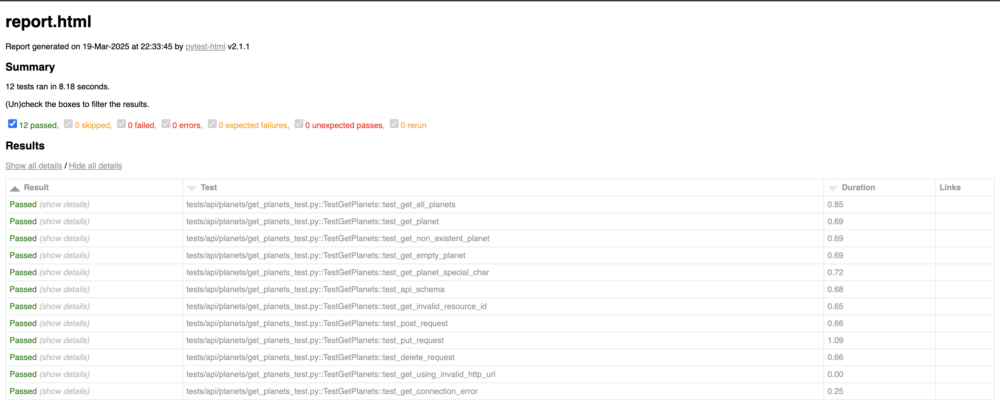

API Automated Tests  
------------  
This test repo contains automated tests for the star wars apis 'planets' endpoint https://swapi.dev/documentation#planets 
I have mainly used `pytest` and `requests` library for functional testing and `pytest-html` for reporting
along with some other libs to follow best practices and make it more efficient

Requirements  
-----------------------  
To run the automated tests, Python3.9 or above is needed:  
https://www.python.org/downloads/release  
  
Install  
-----------------------  
Clone the repo  

`git clone https://github.com/nileshpandey3/star_wars_api_tests.git`
  
After cloning the repo, cd into it

Install dependencies (Feel free to create a virtual env if you like)

`pip3 install -r requirements.txt`

File Structure  
----  
I have placed all the tests here `tests/api/planets/get_planets_test.py` 
All the new test files should be put within the `/test/{resource_name}`
  
Usage  
-----  
To run the tests in parallel, with your choice of pytest mark, generate html report, rerun failed test and allow ipdb tracing  

`pytest -n auto --dist=loadscope -m test_mark --html report.html --reruns 2 --reruns-delay 5 -s`  
e.g.
`pytest -n auto --dist=loadscope -m planets_api --html report.html --reruns 2 --reruns-delay 5 -s`

you can also run a single test by using its corresponding mark e.g. to run this test 
`def test_get_planet()` 
`pytest -m get_planet -s`

OR if you just want to run all the tests and see the results on cli simply run

e.g. `pytest -s`

Note: If you want an easily sharable html test report then run with `--self-contained-html`

Example of a successful test report
-----------------------------------

  
Linting check before making a commit  
----  
We should make sure that the code is following best and pythonic coding standards, please run
  
`pylint $(git ls-files '*.py')`
